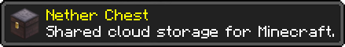
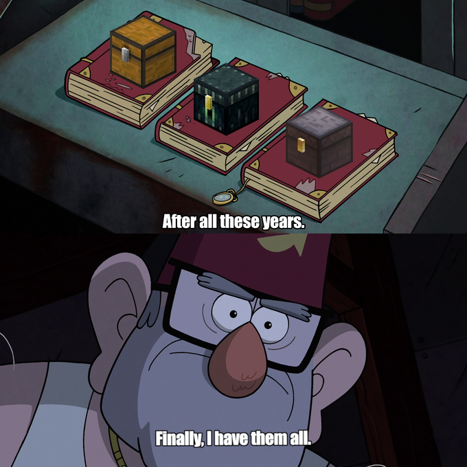
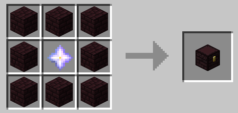

# Nether Chest (Fabric)
[](https://github.com/Kir-Antipov/nether-chest/releases/latest)
[](https://github.com/Kir-Antipov/nether-chest/actions/workflows/build-artifacts.yml)
[![Modrinth](https://img.shields.io/badge/dynamic/json?color=5da545&label=Modrinth&query=title&url=https://api.modrinth.com/api/v1/mod/nether-chest&style=flat&cacheSeconds=3600&logo=data:image/svg+xml;base64,PHN2ZyB4bWxucz0iaHR0cDovL3d3dy53My5vcmcvMjAwMC9zdmciIHZpZXdCb3g9IjAgMCAxMSAxMSIgd2lkdGg9IjE0LjY2NyIgaGVpZ2h0PSIxNC42NjciICB4bWxuczp2PSJodHRwczovL3ZlY3RhLmlvL25hbm8iPjxkZWZzPjxjbGlwUGF0aCBpZD0iQSI+PHBhdGggZD0iTTAgMGgxMXYxMUgweiIvPjwvY2xpcFBhdGg+PC9kZWZzPjxnIGNsaXAtcGF0aD0idXJsKCNBKSI+PHBhdGggZD0iTTEuMzA5IDcuODU3YTQuNjQgNC42NCAwIDAgMS0uNDYxLTEuMDYzSDBDLjU5MSA5LjIwNiAyLjc5NiAxMSA1LjQyMiAxMWMxLjk4MSAwIDMuNzIyLTEuMDIgNC43MTEtMi41NTZoMGwtLjc1LS4zNDVjLS44NTQgMS4yNjEtMi4zMSAyLjA5Mi0zLjk2MSAyLjA5MmE0Ljc4IDQuNzggMCAwIDEtMy4wMDUtMS4wNTVsMS44MDktMS40NzQuOTg0Ljg0NyAxLjkwNS0xLjAwM0w4LjE3NCA1LjgybC0uMzg0LS43ODYtMS4xMTYuNjM1LS41MTYuNjk0LS42MjYuMjM2LS44NzMtLjM4N2gwbC0uMjEzLS45MS4zNTUtLjU2Ljc4Ny0uMzcuODQ1LS45NTktLjcwMi0uNTEtMS44NzQuNzEzLTEuMzYyIDEuNjUxLjY0NSAxLjA5OC0xLjgzMSAxLjQ5MnptOS42MTQtMS40NEE1LjQ0IDUuNDQgMCAwIDAgMTEgNS41QzExIDIuNDY0IDguNTAxIDAgNS40MjIgMCAyLjc5NiAwIC41OTEgMS43OTQgMCA0LjIwNmguODQ4QzEuNDE5IDIuMjQ1IDMuMjUyLjgwOSA1LjQyMi44MDljMi42MjYgMCA0Ljc1OCAyLjEwMiA0Ljc1OCA0LjY5MSAwIC4xOS0uMDEyLjM3Ni0uMDM0LjU2bC43NzcuMzU3aDB6IiBmaWxsLXJ1bGU9ImV2ZW5vZGQiIGZpbGw9IiM1ZGE0MjYiLz48L2c+PC9zdmc+)](https://modrinth.com/mod/nether-chest)
[](https://www.curseforge.com/minecraft/mc-mods/nether-chest)
[](https://github.com/Kir-Antipov/nether-chest#readme)

I like to think of the storage blocks presented in Minecraft as the different types of data storages that we meet in our everyday life:

 - An ordinary chest is a hard drive: it's (basically) stationary, and you can access what it stores only through direct contact
 - A shulker box is similar to a USB flash drive: it's portable, and things it stores can also be accessed exclusively through direct contact
 - And an ender chest is just like remote personal storage: just upload your belongings to the "cloud", and you'll have access to them from anywhere in the world at any time!

Don't you think, that something's missing? There's only personal cloud storage, but there's no shared one that could act as a kind of file sharing service. And don't you find it strange that we have an overworld chest, an ender chest, but no nether chest? Well, behold!



This mod adds a single block to the game - the nether chest. It acts pretty much the same way as an ender chest, except that it has a shared inventory for all players on a server.

### Crafting Recipe:



This crafting recipe may seem a little bit expensive, but from a balancing point of view, everything is more than justified:

 - This mod is intended for multiplayer *(I mean, what's the point in the nether chest in single player if it's indistinguishable from a regular ender chest?)*. The Wither is an extremely weak enemy for several players even at the maximum difficulty level. So getting a couple of extra nether stars won't be difficult task for you and your friends
 - The nether chest is an "endgame" block. If you can spend a nether star to craft a chest, then trite time-saving isn't cheating. However, in the early game stages, exchanging items between players that are separated by thousands of blocks may be overpowered

**NOTE:** nether chests should be silk touched if you don't want to lose your nether stars :)

----

## Installation

Requirements:
 - Minecraft `1.16.x`
 - Fabric Loader `>=0.7.0`
 - Fabric API `>=0.25.0`

You can download the mod from:

 - [GitHub Releases](https://github.com/Kir-Antipov/nether-chest/releases/) <sup><sub>(recommended)</sub></sup>
 - [Modrinth](https://modrinth.com/mod/nether-chest)
 - [CurseForge](https://www.curseforge.com/minecraft/mc-mods/nether-chest-fabric)
 - [GitHub Actions](https://github.com/Kir-Antipov/nether-chest/actions/workflows/build-artifacts.yml) *(these builds may be unstable, but they represent the actual state of the development)*

## Building from sources

Requirements:
 - JDK `16`

### Linux/MacOS

```cmd
git clone https://github.com/Kir-Antipov/nether-chest.git
cd nether-chest

chmod +x ./gradlew
./gradlew build
cd build/libs
```
### Windows

```cmd
git clone https://github.com/Kir-Antipov/nether-chest.git
cd nether-chest

gradlew build
cd build/libs
```