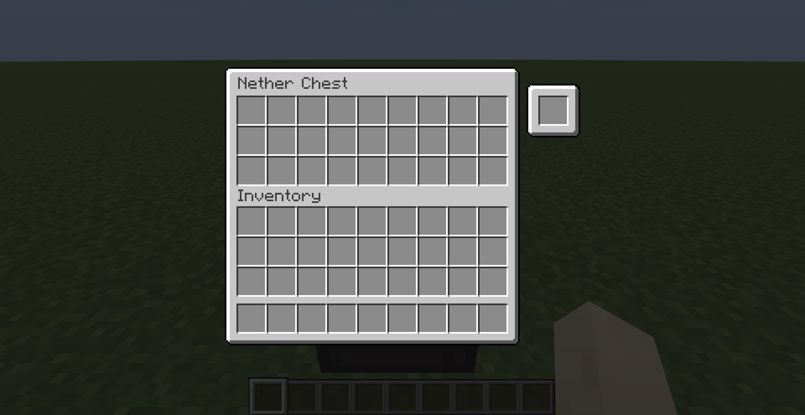
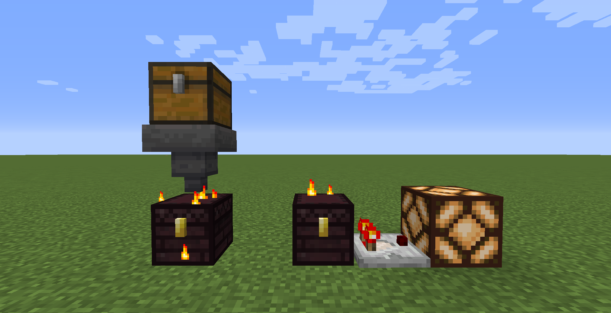

# Nether Chest (Fabric)
[](https://github.com/Kir-Antipov/nether-chest/releases/latest)
[](https://github.com/Kir-Antipov/nether-chest/actions/workflows/build-artifacts.yml)
[](https://modrinth.com/mod/nether-chest)
[](https://www.curseforge.com/minecraft/mc-mods/nether-chest-fabric)
[](https://github.com/Kir-Antipov/nether-chest#readme)

I like to think of the storage blocks presented in Minecraft as the different types of data storages that we meet in our everyday life:

 - An ordinary chest is a hard drive: it's (basically) stationary, and you can access what it stores only through direct contact
 - A shulker box is similar to a USB flash drive: it's portable, and things it stores can also be accessed exclusively through direct contact
 - And an ender chest is just like remote personal storage: just upload your belongings to the "cloud", and you'll have access to them from anywhere in the world at any time!

Don't you think, that something's missing? There's only personal cloud storage, but there's no shared one that could act as a kind of file sharing service. And don't you find it strange that we have an overworld chest, an ender chest, but no nether chest? Well, behold!


This mod adds a single block to the game - the nether chest. It acts pretty much the same way as an ender chest, except that it has a shared inventory for all players on a server.

### Crafting Recipe:


This crafting recipe may seem a little bit expensive, but from a balancing point of view, everything is more than justified:

 - The Wither is an extremely weak enemy even at the maximum difficulty level. So getting a couple of extra nether stars won't be a difficult task for you.
 - The nether chest is an "endgame" block. If you can spend a nether star to craft a chest, then trite time-saving isn't cheating. However, in the early game stages, exchanging items between players that are separated by thousands of blocks may be overpowered.

**NOTE:** nether chests should be silk touched if you don't want to lose your nether stars :)

If you play on peaceful (or just aren't brave enough to fight the Wither), you can use [this datapack](media/simplified_nether_chest_recipe_datapack.zip) (it will swap the nether star with an eye of ender). Please read [this article](https://minecraft.fandom.com/wiki/Tutorials/Installing_a_data_pack), if you don't know how to do it.

### Multichannel Mode



If the multichannel mode is enabled, each nether chest gets one extra slot that can be used to lock a chest to a specific channel with its own unique inventory.

### Redstone Integration



As you can see, nether chests are compatible with hoppers and comparators. However, this feature is **disabled** by default.

### Config

| Name | Description | Default value |
| ---- | ----------- | ------------- |
| `allowHoppers` | If this option is enabled, hoppers will be able to access the nether chest's inventory | `false` |
| `allowInsertion` | If this option is enabled, hoppers will be able to pump items into the nether chest's inventory | `true` |
| `allowExtraction` | If this option is enabled, hoppers will be able to pump items out of the nether chest's inventory | `true` |
| `enableMultichannelMode` | If this option is enabled, nether chests can be locked to a specific channel | `true` |
| `ignoreNbtInMultichannelMode` | If this option is enabled, channel keys are no longer obligated to have the same NBT in order to be considered equal | `false` |
| `ignoreCountInMultichannelMode` | If this option is enabled, channel keys are no longer obligated to have the same stack size in order to be considered equal | `false` |
| `channelBlacklist` | Items whose IDs are listed in this field are banned from becoming channel keys | `[]` |
| `channelWhitelist` | Only those items whose IDs are listed in this field can be treated as channel keys | `[]` |

----

## Installation

Requirements:
 - Minecraft `1.19.x`
 - Fabric Loader `>=0.14.0`
 - Fabric API `>=0.55.2`

You can download the mod from:

 - [GitHub Releases](https://github.com/Kir-Antipov/nether-chest/releases/) <sup><sub>(recommended)</sub></sup>
 - [Modrinth](https://modrinth.com/mod/nether-chest)
 - [CurseForge](https://www.curseforge.com/minecraft/mc-mods/nether-chest-fabric)
 - [GitHub Actions](https://github.com/Kir-Antipov/nether-chest/actions/workflows/build-artifacts.yml) *(these builds may be unstable, but they represent the actual state of the development)*

## Building from sources

Requirements:
 - JDK `17`

### Linux/MacOS

```cmd
git clone https://github.com/Kir-Antipov/nether-chest.git
cd nether-chest

chmod +x ./gradlew
./gradlew build
cd build/libs
```
### Windows

```cmd
git clone https://github.com/Kir-Antipov/nether-chest.git
cd nether-chest

gradlew build
cd build/libs
```
